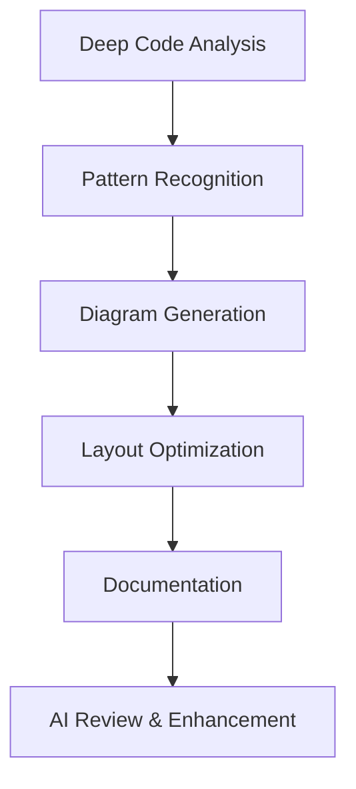
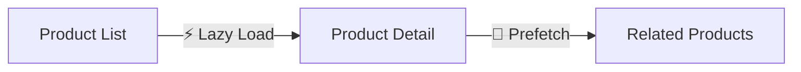

# Args: `<screen-flow-name>` `[development-mode]`. v1.0.0. Execute creative development methods for generating comprehensive screen flow diagrams. Uses AI-assisted analysis, pattern recognition, and intelligent suggestions to create detailed, production-ready screen flows.

**🚨 COMMAND EXECUTION NOTICE**: This is a Claude command file, not a bash script. Claude will process this file and execute the appropriate operations. DO NOT attempt to run this as `/execute-screen-flow-dev` in bash.

## Summary

Executes advanced screen flow development using the project structure created by `update-screenflows` in project analysis mode. This command focuses on creative methods for analyzing codebases, discovering patterns, generating intelligent diagrams, and producing comprehensive documentation. It uses AI-powered analysis to understand component relationships, user journeys, state management patterns, and creates production-ready Mermaid diagrams with detailed annotations.

## Usage

```bash
/design:execute-screen-flow-dev <screen-flow-name> [development-mode]
```

## Arguments

- `<screen-flow-name>`: Name of existing screen flow project (REQUIRED)
  - Must match a project created by `update-screenflows` in project analysis mode
  - Located in `designs/screen-flows/{screen-flow-name}`
  - Examples: `user-onboarding`, `checkout-flow`, `admin-dashboard`

- `[development-mode]`: Development approach to use (OPTIONAL)
  - Default: `comprehensive`
  - Options:
    - `comprehensive`: Full analysis with all diagram types
    - `focused`: Specific feature or flow analysis
    - `iterative`: Progressive enhancement mode
    - `collaborative`: Team-oriented with annotations
    - `rapid`: Quick generation for prototyping

## Examples

```bash
# Execute comprehensive screen flow development
/design:execute-screen-flow-dev user-onboarding

# Use focused mode for specific feature analysis
/design:execute-screen-flow-dev checkout-flow focused

# Rapid prototyping mode
/design:execute-screen-flow-dev admin-dashboard rapid

# Collaborative mode with detailed annotations
/design:execute-screen-flow-dev mobile-app-flow collaborative

# Iterative enhancement of existing flows
/design:execute-screen-flow-dev auth-flow iterative
```

## What This Command Does

This command uses creative AI-powered methods to develop comprehensive screen flows:

### Creative Development Methods

1. **AI-Powered Code Analysis**
   - Deep component relationship mapping
   - Intelligent pattern recognition
   - Context-aware navigation discovery
   - State management flow analysis
   - Data dependency tracking

2. **Smart Diagram Generation**
   - Auto-layout optimization
   - Intelligent grouping and clustering
   - Color-coded semantic relationships
   - Interactive annotation layers
   - Responsive design considerations

3. **Pattern Recognition**
   - Common UI patterns identification
   - Authentication flow detection
   - CRUD operation mapping
   - Error handling pathways
   - Loading state patterns

4. **User Journey Mapping**
   - Entry point analysis
   - Critical path identification
   - Alternative flow discovery
   - Edge case documentation
   - Accessibility pathways

### Development Modes

#### Comprehensive Mode (Default)


#### Focused Mode
- Targets specific features or user flows
- Detailed component interaction mapping
- Micro-interaction documentation
- State transition analysis
- Performance consideration notes

#### Iterative Mode
- Builds on existing diagrams
- Tracks changes between versions
- Highlights new additions
- Documents removed features
- Maintains change history

#### Collaborative Mode
- Extensive inline documentation
- Design decision rationale
- Implementation notes
- Team discussion points
- Integration guidelines

#### Rapid Mode
- Quick skeleton generation
- Basic flow mapping
- Placeholder for details
- Fast iteration support
- Prototype-ready output

### Generated Outputs

The command generates these files in `diagrams/` directory:

1. **overview.mmd** - Complete application flow
   - Enhanced with discovered patterns
   - Semantic grouping of related screens
   - Entry/exit point highlighting
   - Critical path emphasis

2. **navigation.mmd** - User journey maps
   - Multiple persona pathways
   - Decision tree visualization
   - Alternative flow branches
   - Error recovery paths

3. **components.mmd** - Component architecture
   - Atomic design hierarchy
   - Composition patterns
   - Prop flow visualization
   - Reusability indicators

4. **states.mmd** - State management flows
   - Global state mapping
   - Local state interactions
   - Side effect visualization
   - Data flow direction

5. **data-flow.mmd** - Data architecture
   - API integration points
   - Cache layer visualization
   - Real-time data flows
   - Optimization opportunities

6. **interactions.mmd** - User interactions (NEW)
   - Click/tap targets
   - Gesture support
   - Keyboard navigation
   - Accessibility features

7. **responsive.mmd** - Responsive design (NEW)
   - Breakpoint transitions
   - Layout adaptations
   - Component variations
   - Platform-specific flows

### AI-Enhanced Features

1. **Smart Suggestions**
   ```javascript
   // AI analyzes code patterns and suggests:
   - Missing navigation paths
   - Potential user confusion points
   - Performance bottlenecks
   - Accessibility improvements
   - Security considerations
   ```

2. **Pattern Library Integration**
   - Recognizes common UI patterns
   - Suggests standard implementations
   - Links to design system components
   - Provides best practice examples

3. **Intelligent Annotations**
   - Context-aware comments
   - Implementation complexity notes
   - Performance impact indicators
   - Security consideration flags

4. **Automated Documentation**
   - Generates descriptive text
   - Creates implementation guides
   - Produces design rationale
   - Builds component specs

### Creative Analysis Techniques

1. **Component Clustering**
   ```mermaid
   graph TB
     subgraph "Feature Cluster 1"
       A[Component A] --> B[Component B]
       B --> C[Component C]
     end
     
     subgraph "Feature Cluster 2"
       D[Component D] --> E[Component E]
     end
     
     %% AI identifies natural groupings
   ```

2. **Flow Complexity Analysis**
   - Identifies complex user paths
   - Suggests simplification opportunities
   - Highlights cognitive load areas
   - Recommends progressive disclosure

3. **Cross-Reference Mapping**
   - Links related flows across features
   - Identifies shared components
   - Maps data dependencies
   - Shows impact analysis

## Script Integration

The command leverages AI-enhanced scripts:

```bash
# AI-powered analyzer
AI_ANALYZER=".claude/scripts/design/execute-screen-flow-dev_ai-analyzer.sh"
if [[ -f "$AI_ANALYZER" ]]; then
    echo "🤖 Using AI-enhanced analysis..."
    "$AI_ANALYZER" "$SCREEN_FLOW_NAME"
fi

# Pattern recognition engine
PATTERN_ENGINE=".claude/scripts/design/execute-screen-flow-dev_patterns.sh"
if [[ -f "$PATTERN_ENGINE" ]]; then
    echo "🔍 Running pattern recognition..."
    "$PATTERN_ENGINE" "$PROJECT_PATH"
fi

# Diagram optimizer
OPTIMIZER=".claude/scripts/design/execute-screen-flow-dev_optimizer.sh"
if [[ -f "$OPTIMIZER" ]]; then
    echo "✨ Optimizing diagram layouts..."
    "$OPTIMIZER" "$DESIGN_FOLDER/diagrams"
fi
```

## Implementation Details

```bash
#!/bin/bash
set -euo pipefail

# Validate arguments
SCREEN_FLOW_NAME="$1"
DEVELOPMENT_MODE="${2:-comprehensive}"
DESIGN_FOLDER="designs/screen-flows/$SCREEN_FLOW_NAME"

# Check project exists
if [[ ! -d "$DESIGN_FOLDER" ]]; then
    echo "❌ Error: Screen flow project not found: $SCREEN_FLOW_NAME"
    echo "Run 'update-screenflows <name> <project-path>' first to create project structure"
    exit 1
fi

# Load project configuration
CONFIG_FILE="$DESIGN_FOLDER/.screen-flow-config.json"
if [[ ! -f "$CONFIG_FILE" ]]; then
    echo "❌ Error: Configuration file not found"
    exit 1
fi

# Extract configuration
PROJECT_PATH=$(jq -r '.sourcePath' "$CONFIG_FILE")
PROJECT_TYPE=$(jq -r '.projectType' "$CONFIG_FILE")
OUTPUT_FORMAT=$(jq -r '.outputFormat' "$CONFIG_FILE")

echo "🚀 Executing screen flow development"
echo "📊 Mode: $DEVELOPMENT_MODE"
echo "📁 Project: $SCREEN_FLOW_NAME"

# AI-powered analysis phase
echo -e "\n🤖 Starting AI-enhanced analysis..."

# Deep code analysis
case "$DEVELOPMENT_MODE" in
    comprehensive)
        # Full analysis with all features
        analyze_routes
        analyze_components
        analyze_state_management
        analyze_navigation_patterns
        analyze_data_flows
        analyze_interactions
        analyze_responsive_design
        ;;
    focused)
        # Targeted analysis
        echo "🎯 Enter feature/flow to focus on:"
        read -r FOCUS_AREA
        analyze_specific_feature "$FOCUS_AREA"
        ;;
    iterative)
        # Build on existing
        load_previous_analysis
        analyze_changes
        update_diagrams
        ;;
    collaborative)
        # Team-oriented
        analyze_with_annotations
        generate_discussion_points
        create_implementation_notes
        ;;
    rapid)
        # Quick generation
        rapid_route_scan
        basic_component_map
        simple_flow_generation
        ;;
esac

# Generate enhanced diagrams
echo -e "\n📊 Generating intelligent diagrams..."

# Create each diagram type with AI enhancements
generate_overview_diagram
generate_navigation_diagram
generate_component_diagram
generate_state_diagram
generate_data_flow_diagram

# Additional diagrams for comprehensive mode
if [[ "$DEVELOPMENT_MODE" == "comprehensive" ]]; then
    generate_interaction_diagram
    generate_responsive_diagram
fi

# AI review and optimization
echo -e "\n✨ Applying AI optimizations..."
optimize_diagram_layouts
add_intelligent_annotations
generate_implementation_guide

# Create comprehensive report
generate_comprehensive_report

echo -e "\n✅ Screen flow development complete!"
echo "📁 Generated diagrams: $DESIGN_FOLDER/diagrams/"
echo "📄 Report: $DESIGN_FOLDER/diagrams/report.md"
```

## Advanced Features

### 1. AI-Powered Suggestions
```javascript
// Example AI suggestions in generated diagrams
graph TD
    Login[Login Page]
    Dashboard[Dashboard]
    
    Login -->|Success| Dashboard
    Login -.->|AI: Add password reset flow| PasswordReset[Password Reset]
    
    style PasswordReset fill:#ffeb3b,stroke:#f57c00
    
    %% AI Suggestion: Consider adding:
    %% - Remember me functionality
    %% - Social login options
    %% - Two-factor authentication
```

### 2. Pattern Recognition Results
- **Authentication Pattern**: Standard login/logout flow detected
- **CRUD Pattern**: Full Create-Read-Update-Delete operations found
- **Search Pattern**: Filter and search functionality identified
- **Wizard Pattern**: Multi-step form process discovered

### 3. Performance Annotations


### 4. Accessibility Pathways
- Keyboard navigation routes documented
- Screen reader flow paths
- Focus management indicators
- ARIA landmark mapping

## Requirements

- Existing screen flow project (created by `update-screenflows` in project analysis mode)
- Valid configuration file
- Access to source project
- Standard UNIX utilities
- Optional: `jq` for JSON processing

## Error Handling

- **Project Not Found**: Clear message to run update-screenflows with project analysis mode first
- **Configuration Missing**: Regeneration instructions provided
- **Analysis Failures**: Graceful degradation with partial results
- **Generation Errors**: Detailed error logging with recovery steps

## Related Commands

- `/design:update-screenflows` - Create project structure and generate diagrams
- `/design:update-screen-flow` - Original combined command (deprecated)
- `/ai:analyze-codebase` - General codebase analysis
- `/project:visualize-architecture` - Architecture visualization

## Notes

- **AI-Enhanced**: Uses intelligent analysis for better insights
- **Mode Flexibility**: Different modes for different needs
- **Incremental Updates**: Supports iterative development
- **Team Collaboration**: Built for team workflows
- **Production Ready**: Generates professional documentation
- **Pattern Library**: Recognizes and suggests standard patterns
- **Performance Focus**: Includes performance considerations
- **Accessibility First**: Documents accessibility requirements

## Version History

- **v1.0.0** - Initial version split from update-screen-flow
  - Creative AI-powered analysis methods
  - Multiple development modes
  - Enhanced pattern recognition
  - Intelligent diagram generation
  - Comprehensive documentation
  - Team collaboration features